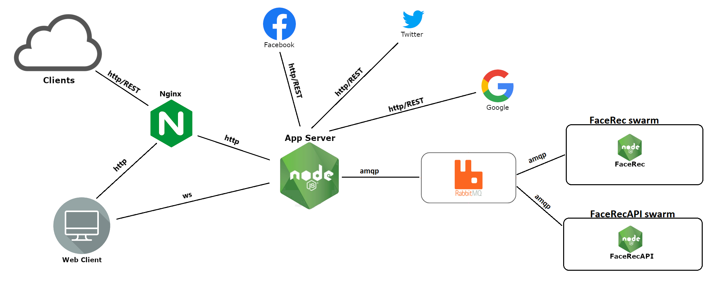

# likeUS

# Scopo del progetto

Il progetto realizza un servizio di riconoscimento facciale accedibile tramite interfaccia web o con una API REST.

# Architettura e tecnologie



Gli elementi architetturali rappresentati nell'immagine sono ora presentati nel dettaglio:

- **Nginx**: Web server utilizzato per servire i contenuti statici, la home del sito web in particolare, e che si comporta come reverse proxy nei confronti dei client che accedono al sito tramite pagina web e API. Rappresentato mediante un container docker, espone la porta 80 sulla network dell'host.
- **Application Server**: implementa la logica dell'applicazione:
    - Accede tramite API REST a 3 servizi commerciali:
        - **Facebook**: permette al web client di recuperare la sua immagine del profilo, e utilizzarla come uno dei due input per il Face Recognition.
        - **Google**: permette al web client di caricare l'immagine risultante dal processamento con annessa percentuale di somiglianza sul proprio google drive personale.
        - **Twitter**: permette al web client di pubblicare il risultato come twitt sul proprio profilo twitter
    - Inoltra al broker RabbitMQ la richiesta di processamento delle immagini provenienti sia dai web client che dai client che interagiscono mediante l'API REST.
- **RabbitMQ**: broker utilizzato per lavorare con il protocollo asincrono amqp, necessario per implementare il pattern Remote procedure call, imperativo in questo tipo di applicazione poichè il processamento delle immagini è un operazione resource intensive che impiega un certo tempo.
- **FaceRecAPI swarm e FaceRec swarm**: sono due gruppi di server rispettivamente destinati ad esaudire le richieste dei REST client e dei web client. Nella pratica ci si aspetta una molteplicità di worker server per ogni gruppo sui quali viene fatto load balancing, nell'ambito del progetto, per motivi di praticità, a ciascuno gruppo corrisponde un solo server rappresentato come un container. Vengono utilizzati due swarm distinti per assicurare maggiore capacità di processing ai Rest client, che potrebbero desiderare un servizio più veloce rispetto ai web client.
- **FaceRec/FaceRecAPI**: applicazione node che implementa il Face Recognition. La funzione FaceRec carica le immagini da comparare in dei canvas e, tramite faceapi, estrae un descrittore del volto più definito in ogni immagine, i descrittori vengono usati per calcolare la somiglianza tramite distanza euclidea, il risultato sarà scritto su un canvas insieme alle due immagini originali.
Utilizzando la distanza euclidea, la percentuale mostrata in output non è lineare ma esponenziale, quindi dei risultati superiori al 40% indicano una forte somiglianza tra i due volti.

# Istruzioni per l'installazione

Prerequisiti:
 - Docker installato sulla macchina.
 - 8 GB di spazio libero sul disco.


È possibile aggiungere workers facerecapi e facerec semplicemente modificando il file docker-compose aggiungnendo arbitrariamente servizi del tipo:

- per dichiarare nuovi workers facerec:

```
<new_worker_facerec_service_name>:
        restart: always
        build:
            context: ./FaceRec
            args: 
                - QUEUE_ARG=rpc_queue
                - ENCODING_ARG=binary
        depends_on: 
            - "rabbitmq"
        container_name: <container_name>
```

- per dichiarare nuovi workers facerecapi:

```
<new_worker_facerecapi_service_name>:
        restart: always
        build:
            context: ./FaceRec
            args: 
                - QUEUE_ARG=rpcAPI_queue
                - ENCODING_ARG=base64
        depends_on: 
            - "rabbitmq"
        container_name: <container_name>
```

L'installazione dell'app prevede pochi e semplici passaggi:

- Scaricare il progetto github.
- Posizionandosi sulla cartella radice del progetto eseguire il comando: **docker-compose up --build**. Questo comando installa l'architettura basata sui container descritta nella sezione precedente e li avvia correttamente. A seguito dell'installazione l'applicazione viene automaticamente avviata. Il servizio può essere messo in pausa con la combinazione **CTRL+C** dalla schell su cui è stata lanciata. L'applicazione può essere riavviata in ogni momento tramite il comando **docker-compose up** lanciato sempre sulla directory radice del progetto git.

# Istruzione per il test

La home page del sito può essere raggiunta con un qualsiasi web browser commerciale all'indirizzo http://localhost/home/.

Nel progetto è incluso anche un client Node.js per testare l'API che espone il servizio. La cartella ImagesToSend contiene già delle immagini di prova ma si può popolare ulteriormente con altre immagini.

Spostarsi quindi nella cartella ClientDiProva e lanciare il comando: **node APIclient.js <first_image_name> <second_image_name> <result_image_path_name>**. *first_image_name* e *second_image_name* sono i nomi di due immagini arbitrarie presenti nella cartella ImagesToSend mentre *result_image_path_name* è il percorso con nome dell'immagine che conterrà il risultato della chiamata API.